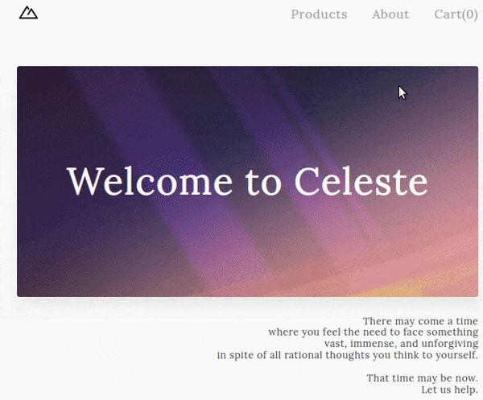

# Shopping Cart
This is fictional ecommerce site owned by the grandma from [celeste](https://exok.com/games/celeste/). A live preview of the project can be seen [here](libmartinito.github.io/shopping-cart).

## Preview


## Motivation
The goal for this project is to reinforce fundamental react learnings. There is an opportunity for managing a more complex state compared to the memory game as well as practicing react-router-dom.

## Tech Used
- [React](https://beta.reactjs.org/)
- [React Router](https://v5.reactrouter.com/web/guides/quick-start)

## Installation
If you want to have a local copy of the project, you can do the following below. However, you need to have [git](https://github.com/git-guides/install-git), [node.js](https://www.freecodecamp.org/news/how-to-install-node-js-on-ubuntu-and-update-npm-to-the-latest-version/), and [npm](https://docs.npmjs.com/downloading-and-installing-node-js-and-npm) installed.
- Open up a terminal
- 
- Clone the repository by typing this in the terminal:
```
git clone git@github.com:libmartinito/shopping-cart.git
```
- Install project dependencies by typing this in the terminal:
```
npm install
```

## Credits
The project is part of the full-stack javascript track at the [odin project](https://www.theodinproject.com/paths/full-stack-javascript/courses/javascript/lessons/shopping-cart). 
